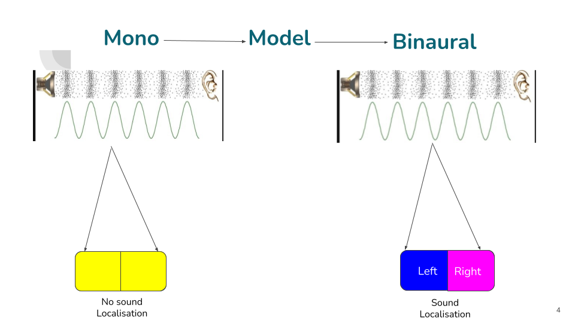
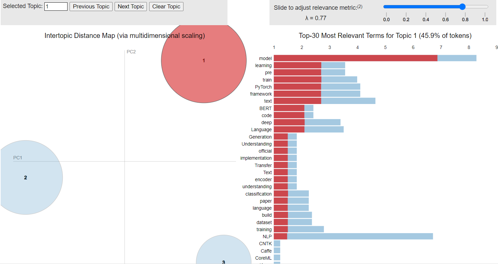
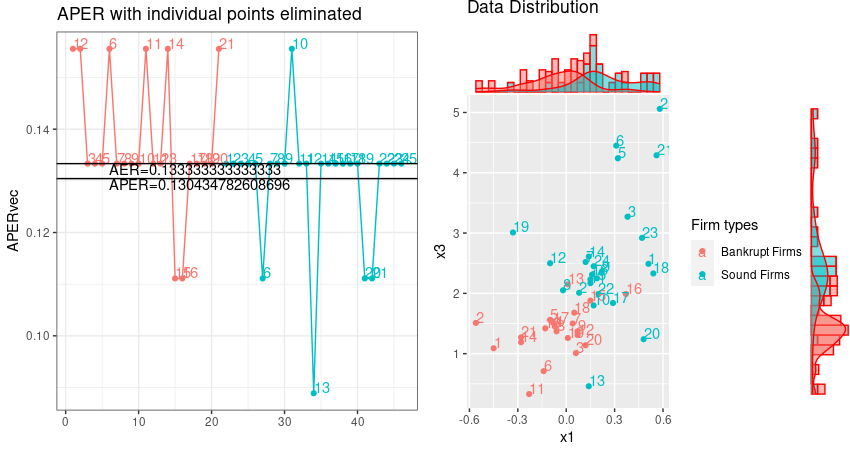
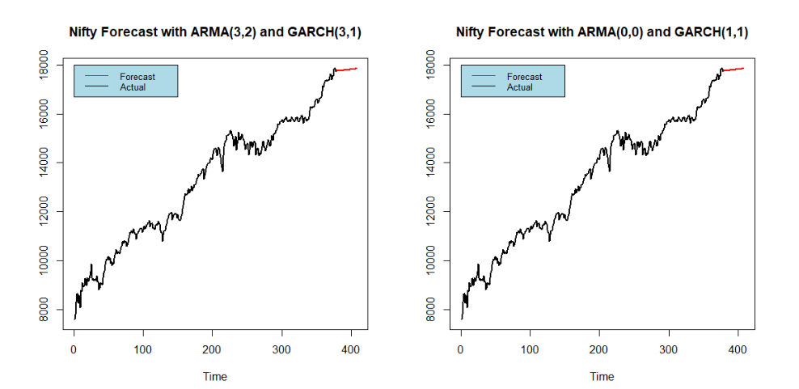
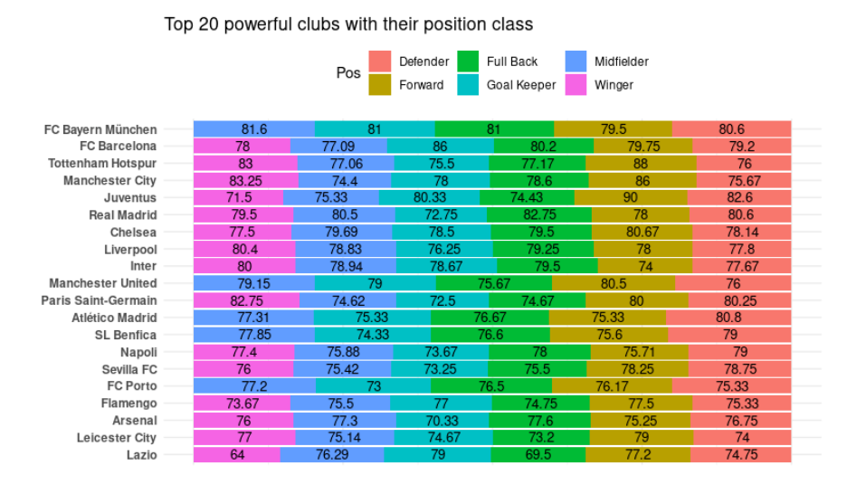
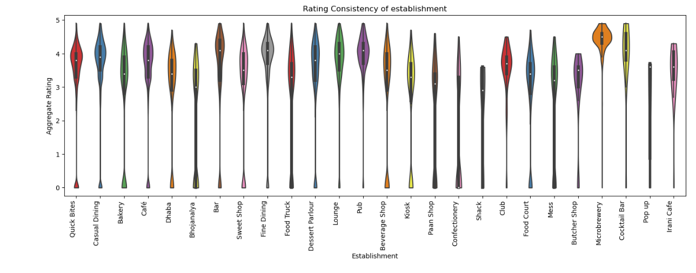

    <h1>Dristanta Das</h1>
    
Data Science & Machine Learning Engineer

    
Transforming data into actionable insights with AI and advanced analytics

    

        3+
        Years Experience
    

    

        12+
        Projects
    

    

        10+
        Technologies
    

    

        ∞
        Learning
    

<h2>Experience</h2>

    

        

            <h3>Genpact</h3>
            
Bengaluru, Karnataka

        

        
Apr 2025 – Present

    

    
Assistant Manager - Data Science

    <ul>
        <li>Architected end-to-end <strong>Text-to-SQL system</strong> using <strong>LangChain</strong> and <strong>LangGraph</strong> for 50+ beta users, reducing query creation time by <strong>65%</strong></li>
        <li>Engineered automated <strong>invoice processing pipeline</strong> with LLMs, achieving <strong>85%+ accuracy</strong> across 10,000+ invoices</li>
        <li>Built robust <strong>agentic workflows</strong> with <strong>92% task completion rate</strong> across LLM-powered applications</li>
        <li>Led integration of LLM solutions with cross-functional teams, scaling to handle <strong>500+ daily queries</strong></li>
    </ul>

    

        

            <h3>UST</h3>
            
Kolkata, West Bengal

        

        
Jul 2022 – Mar 2025

    

    
Associate III Data Scientist (Oct 2022 – Mar 2025)

    <ul>
        <li>Developed provider search system using <strong>advanced NLP</strong> and <strong>LLMs</strong>, boosting search efficiency by <strong>30%</strong></li>
        <li>Implemented <strong>NER</strong> and <strong>semantic search</strong> for medical term retrieval, achieving <strong>25%</strong> efficiency enhancement</li>
    </ul>
    
Associate II Data Scientist (Jul 2022 – Sept 2022)

    <ul>
        <li>Evaluated patient data using <strong>BigQuery</strong>, improving client understanding by <strong>45%</strong> for 10,000+ patients</li>
        <li>Designed data anomaly detection system adhering to <strong>HIPAA</strong> and <strong>GDPR</strong> compliance</li>
    </ul>

<h2>Skills</h2>

    

        <h3>AI/ML</h3>
        
NLP, LLMs, NER, RAG, Machine Learning, Deep Learning, Statistical Modeling

    

    

        <h3>Frameworks</h3>
        
LangChain, LangGraph, PyTorch, Hugging Face, Scikit-learn, XGBoost, FastAPI, Spacy

    

    

        <h3>Tools & Cloud</h3>
        
Python, R, SQL, Git, Docker, BigQuery, Vector DBs, AWS, Azure

    

    

        <h3>Design</h3>
        
Architecture Design, Data Flow Modeling, UML, Anomaly Detection, HIPAA & GDPR

    

<h2>Featured Projects</h2>

    

        <h3>RAG QA Bot</h3>
        <a href="https://github.com/dasdristanta13/RAG-ai-bot" class="github-link" target="_blank">→ GitHub</a>
    

    

        RAG
        LangChain
        BM25
        DPR
        LLMs
    

    

        Python-based QA bot with hybrid retrieval using BM25 and DPR, achieving 40% higher accuracy. Integrated GPT-3.5-turbo, Phi-2, and Llama3 with contextual compression to reduce hallucinations by 60%.
    

    

        <h3>2.5D Visual Sound</h3>
        <a href="https://github.com/dasdristanta13/2.5D-Visual-Sound" class="github-link" target="_blank">→ GitHub</a>
    

    

        Audio Processing
        Computer Vision
        Deep Learning
    

    

        Converting monaural audio into binaural audio by leveraging video, providing listeners with 3D sound sensation and rich perceptual experience.
    

    

    

        <h3>Topic Modelling of NLP Repositories</h3>
        <a href="https://github.com/dasdristanta13/NLP_work/tree/main/Topic_modelling" class="github-link" target="_blank">→ GitHub</a>
    

    

        Topic Modeling
        GitHub API
        spaCy
    

    

        Analyzed popular NLP repositories using GitHub API and spaCy to understand how NLP libraries are being used in the community.
    

    

    

        <h3>Resume Analysis with Spacy</h3>
        <a href="https://github.com/dasdristanta13/NLP_work/tree/main/Resume_Analysis" class="github-link" target="_blank">→ GitHub</a>
    

    

        NLP
        Information Extraction
        Spacy
    

    

        Intelligent resume scoring system using Spacy for automated candidate evaluation and ranking based on job requirements.
    

    

        <h3>Bankruptcy Prediction with LDA</h3>
        <a href="https://github.com/dasdristanta13/Bankruptcy_LDA" class="github-link" target="_blank">→ GitHub</a>
    

    

        LDA
        Statistical Modeling
        Classification
    

    

        Statistical data analysis using Linear Discriminant Analysis with advanced dimensionality reduction to predict financial distress in companies.
    

    

    

        <h3>Financial Time Series Forecasting</h3>
        <a href="https://github.com/dasdristanta13/Time-series" class="github-link" target="_blank">→ GitHub</a>
    

    

        Time Series
        ARIMA
        Financial Analysis
    

    

        Comprehensive forecasting analysis of major global stock indices including Nifty 50, Dax, Dow Jones, and Nikkei using ARIMA models.
    

    

    

        <h3>FIFA 21 Data Analysis</h3>
        <a href="https://github.com/dasdristanta13/Fifa21EDA/blob/main/README.md" class="github-link" target="_blank">→ GitHub</a>
    

    

        EDA
        Sports Analytics
        Python
    

    

        Comprehensive analysis of FIFA 21 player statistics, uncovering insights about attributes, market values, and performance metrics across different positions and nationalities.
    

    

    

        <h3>Zomato Food Data Analysis</h3>
        <a href="https://github.com/dasdristanta13/Zomato_Food_EDA" class="github-link" target="_blank">→ GitHub</a>
    

    

        Data Visualization
        R & Python
        Business Intelligence
    

    

        In-depth analysis of Zomato's restaurant and food delivery data, deriving insights about customer preferences, pricing strategies, and restaurant ratings.
    

    

<meta http-equiv='cache-control' content='no-cache'> 
<meta http-equiv='expires' content='0'> 
<meta http-equiv='pragma' content='no-cache'>
