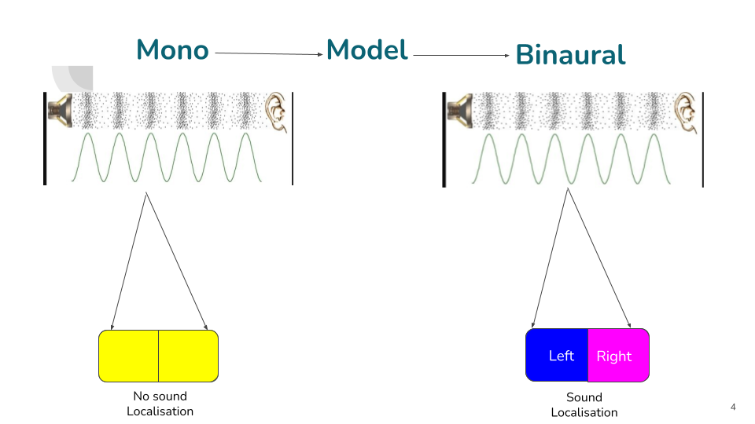
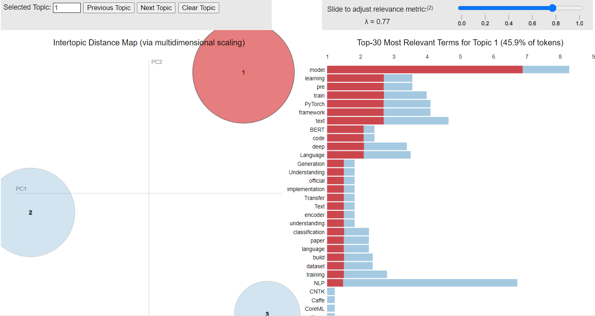
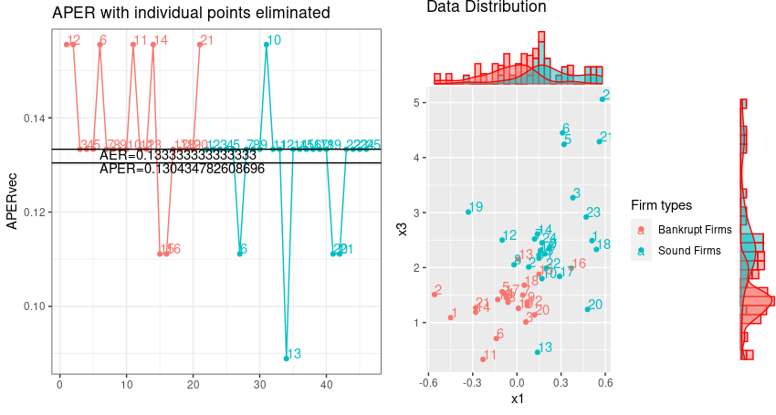
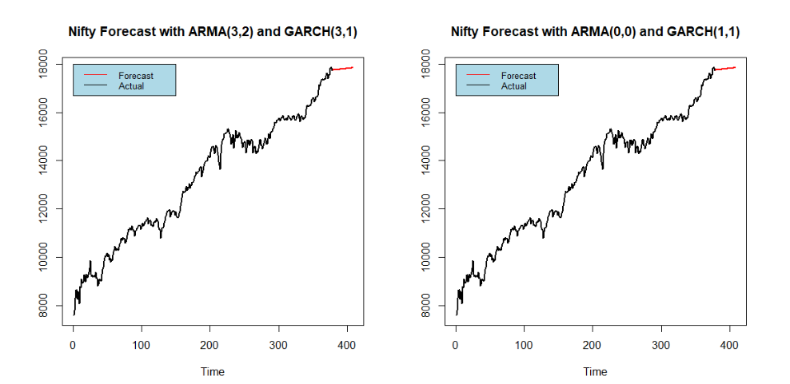
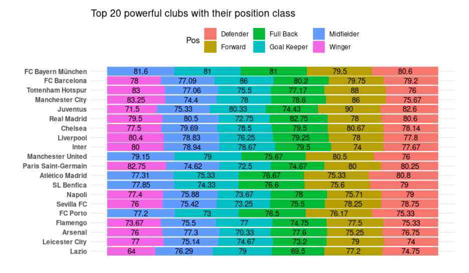
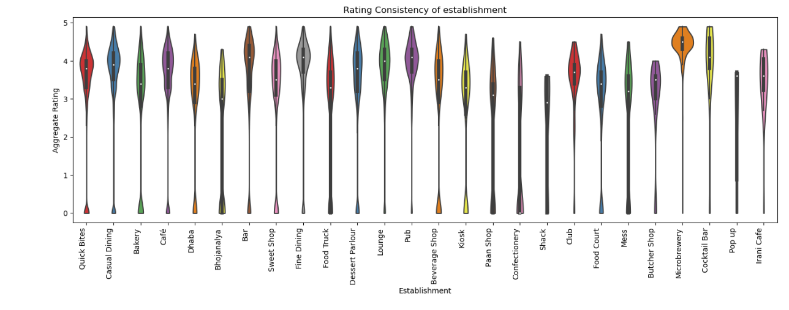

<section class="hero">
  

    

      
Senior Data Scientist at Genpact &middot; Bengaluru

      <h1>I turn slow, manual data workflows into governed, self-service ones.</h1>
      

        I design and ship <strong>Text-to-SQL</strong>, <strong>RAG</strong> and <strong>agentic</strong> systems
        with LangChain, LangGraph and PyTorch. Before Genpact, at UST, I built the provider search system
        (NER plus semantic search) that lifted search efficiency by 30%, still the result I'm asked about most.
      

      

        <a class="btn" href="pdf/Dristanta_Das_Senior_Data_Scientist.pdf" target="_blank" rel="noopener">Download resume</a>
        <a href="https://www.linkedin.com/in/dasdristanta13/" target="_blank" rel="noopener">LinkedIn</a>
        <a href="https://github.com/dasdristanta13" target="_blank" rel="noopener">GitHub</a>
        <a href="mailto:dasdristanta13@gmail.com">Email</a>
      

    

    
  

</section>

<section class="section" id="work">
  

    

      <h2>Production systems</h2>
      
Three systems used by real teams, with the measured result for each.

    

    <article class="case">
      

        <h3>Conversational analytics: Text-to-SQL platform</h3>
        
Genpact

        
An agentic Text-to-SQL platform over a certified semantic layer. Business teams ask in plain English and get a governed, explained answer instead of waiting on a data-team ticket.

        <ul class="tags">
          <li>LangChain</li><li>LangGraph</li><li>Azure OpenAI</li><li>Agentic AI</li><li>Postgres</li>
        </ul>
      

      <dl class="metrics">
        
<dt>faster query formulation</dt><dd>65%</dd>

        
<dt>weekly queries from 50+ beta users</dt><dd>500+</dd>

        
<dt>agent task-completion rate</dt><dd>92%</dd>

        
<dt>cross-functional teams onboarded</dt><dd>12+</dd>

      </dl>
    </article>

    <article class="case">
      

        <h3>Invoice processing pipeline</h3>
        
Genpact

        
An LLM extraction pipeline for multi-format invoices across EMEA and NAM. Structured-output validation and a human-review queue for low-confidence fields replace blind automation.

        <ul class="tags">
          <li>LangChain</li><li>Azure OpenAI</li><li>Prompt engineering</li><li>Structured output</li>
        </ul>
      

      <dl class="metrics">
        
<dt>field-extraction accuracy</dt><dd>85%+</dd>

        
<dt>invoices processed</dt><dd>10,000+</dd>

        
<dt>less manual processing time</dt><dd>60%</dd>

        
<dt>languages across EMEA and NAM</dt><dd>8+</dd>

      </dl>
    </article>

    <article class="case">
      

        <h3>Provider search system</h3>
        
UST

        
An NLP and semantic-search system that maps layperson symptom descriptions to standardized medical terminology, so search resolves meaning rather than keywords. Built on NER and vector retrieval, before the GenAI wave.

        <ul class="tags">
          <li>NLP</li><li>NER</li><li>Semantic search</li><li>Open-source LLMs</li>
        </ul>
      

      <dl class="metrics">
        
<dt>boost in search efficiency</dt><dd>30%</dd>

        
<dt>faster data-preparation tasks</dt><dd>40%</dd>

        
<dt>gain in operational efficiency</dt><dd>25%</dd>

      </dl>
    </article>
  

</section>

<section class="section" id="projects">
  

    

      <h2>More projects</h2>
      
Personal and academic work across retrieval, audio, NLP, statistics and forecasting. Each links to its repository.

    

    

      <article class="tile s7">
        <h3><a href="https://github.com/dasdristanta13/RAG-ai-bot" target="_blank" rel="noopener">RAG QA bot&#8599;</a></h3>
        
A Python QA bot with hybrid retrieval using BM25 and DPR. It integrates GPT-3.5-turbo, Phi-2 and Llama 3, with contextual compression to cut hallucinations.

        

          
<b>40%</b>higher accuracy than traditional search

          
<b>60%</b>fewer hallucinations

        

        <ul class="tags"><li>RAG</li><li>LangChain</li><li>BM25</li><li>DPR</li><li>LLMs</li></ul>
      </article>

      <article class="tile s5">
        <h3><a href="https://github.com/dasdristanta13/2.5D-Visual-Sound" target="_blank" rel="noopener">2.5D Visual Sound&#8599;</a></h3>
        
        
Converts monaural audio to binaural by using the video, giving listeners a 3D sound sensation.

        <ul class="tags"><li>Audio processing</li><li>Computer vision</li><li>Deep learning</li></ul>
      </article>

      <article class="tile s4">
        <h3><a href="https://github.com/dasdristanta13/NLP_work/tree/main/Topic_modelling" target="_blank" rel="noopener">Topic modelling of NLP repositories&#8599;</a></h3>
        
        
Uses the GitHub API and spaCy to see how NLP libraries are used across the community.

        <ul class="tags"><li>Topic modeling</li><li>GitHub API</li><li>spaCy</li></ul>
      </article>

      <article class="tile s4">
        <h3><a href="https://github.com/dasdristanta13/NLP_work/tree/main/Resume_Analysis" target="_blank" rel="noopener">Resume analysis with spaCy&#8599;</a></h3>
        
A resume scoring system that evaluates and ranks candidates against job requirements using spaCy.

        <ul class="tags"><li>NLP</li><li>Information extraction</li><li>spaCy</li></ul>
      </article>

      <article class="tile s4">
        <h3><a href="https://github.com/dasdristanta13/Bankruptcy_LDA" target="_blank" rel="noopener">Bankruptcy prediction with LDA&#8599;</a></h3>
        
        
Linear Discriminant Analysis with dimensionality reduction to predict financial distress in companies.

        <ul class="tags"><li>LDA</li><li>Statistical modeling</li><li>Classification</li></ul>
      </article>

      <article class="tile s7">
        <h3><a href="https://github.com/dasdristanta13/Time-series" target="_blank" rel="noopener">Financial time-series forecasting&#8599;</a></h3>
        
        
ARIMA forecasts for major global indices: Nifty 50, DAX, Dow Jones and Nikkei.

        <ul class="tags"><li>Time series</li><li>ARIMA</li><li>Financial analysis</li></ul>
      </article>

      <article class="tile s5">
        <h3><a href="https://github.com/dasdristanta13/Fifa21EDA/blob/main/README.md" target="_blank" rel="noopener">FIFA 21 data analysis&#8599;</a></h3>
        
        
Player attributes, market values and performance across positions and nationalities.

        <ul class="tags"><li>EDA</li><li>Sports analytics</li><li>Python</li></ul>
      </article>

      <article class="tile s12 wide">
        
        

          <h3><a href="https://github.com/dasdristanta13/Zomato_Food_EDA" target="_blank" rel="noopener">Zomato food data analysis&#8599;</a></h3>
          
Analysis of Zomato restaurant and delivery data covering customer preferences, pricing strategy and ratings.

          <ul class="tags"><li>Data visualization</li><li>R and Python</li><li>Business intelligence</li></ul>
        

      </article>
    

  

</section>

<section class="section" id="experience">
  

    

      <h2>Experience</h2>
    

    

      

        <h3>Genpact</h3>
        
Bengaluru, Karnataka

        
Apr 2025 &ndash; Present

      

      

        
Senior Data Scientist

        <ul>
          <li>Architected and deployed the conversational analytics (Text-to-SQL) platform on LangChain and LangGraph, used by 50+ beta users across 10 concurrent sessions.</li>
          <li>Engineered the agentic workflows behind it: state management, error handling and dynamic routing, scaled to 12+ cross-functional teams.</li>
          <li>Led the automated invoice-processing pipeline on LangChain and Azure OpenAI. Results for both systems are in <a href="#work">Production systems</a>.</li>
        </ul>
      

    

    

      

        <h3>UST</h3>
        
Kolkata, West Bengal

        
Jul 2022 &ndash; Mar 2025

      

      

        
Associate III Data Scientist <small>Oct 2022 &ndash; Mar 2025</small>

        <ul>
          <li>Developed a client-facing provider search system with NLP and open-source LLMs, boosting search efficiency by 30% and speeding data-preparation tasks by 40%.</li>
          <li>Implemented NER and semantic (vector-based) search to map layperson language to medical terms, improving operational efficiency by 25%.</li>
        </ul>
        
Associate II Data Scientist <small>Jul 2022 &ndash; Sep 2022</small>

        <ul>
          <li>Evaluated patient data in BigQuery, improving the client's understanding of adherence drivers by 45% across 10,000+ patients.</li>
          <li>Designed a data anomaly-detection system for categorical healthcare data, in line with HIPAA and GDPR.</li>
        </ul>
      

    

  

</section>

<section class="section" id="skills">
  

    

      <h2>Skills</h2>
    

    <dl class="skills">
      
<dt>AI and ML</dt><dd>NLP, LLMs, NER, RAG, agentic AI, machine learning, deep learning, statistical modeling</dd>

      
<dt>Frameworks</dt><dd>LangChain, LangGraph, PyTorch, Hugging Face, scikit-learn, XGBoost, FastAPI, spaCy</dd>

      
<dt>Tools and cloud</dt><dd>Python, R, SQL, Git, Docker, BigQuery, vector databases, AWS, Azure (Azure OpenAI)</dd>

      
<dt>Design and governance</dt><dd>Architecture design, data-flow modeling, UML, anomaly detection, HIPAA and GDPR compliance</dd>

    </dl>
  

</section>
